# Portal CACC Backend — Arquitetura Atual (2026)

Documentação técnica consolidada da arquitetura **real** implementada no backend Go (`module cacc`), com foco em camadas, fluxos de negócio, modelos e integrações.

---

## 1) Visão de Contexto (C4-like)

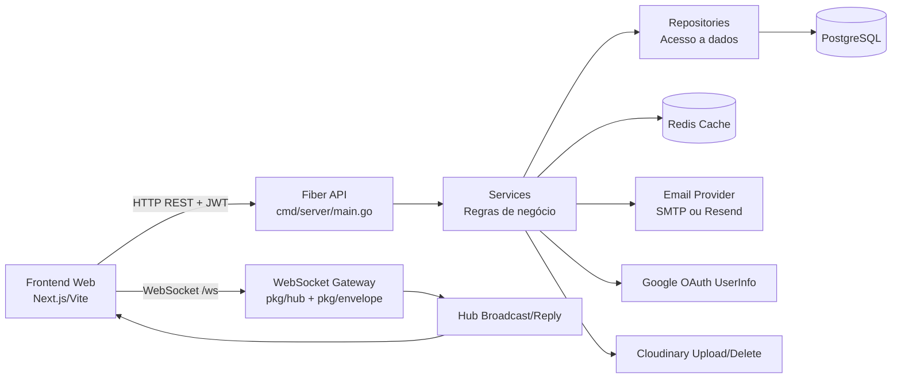

---

## 2) Arquitetura em Camadas (Código)

```mermaid
flowchart TB
    subgraph EntryPoints[Entry Points]
      MAIN[cmd/server/main.go]
      HTTP[handlers/*]
      WSGW[/ws + parseWSToken]
    end

    subgraph AppLayer[Application Layer]
      AUTHSVC[services/auth_service.go]
      SOCIALSVC[services/social_service.go]
      NOTISVC[(notification flow via social + repo)]
      NEWSSVC[services/noticias_service.go]
      SUGSVC[services/sugestoes_service.go]
      BUSSVC[services/bus_service.go]
      GALSVC[services/galeria_service.go]
      EMAILSVC[services/email_service.go]
    end

    subgraph DataLayer[Data Layer]
      AUTHREPO[repository/auth_repository.go]
      SOCIALREPO[repository/social_repository.go]
      NOTIREPO[repository/notification_repository.go]
      NEWSREPO[repository/noticias_repository.go]
      SUGREPO[repository/sugestoes_repository.go]
      BUSREPO[repository/bus_repository.go]
      GALREPO[repository/galeria_repository.go]
    end

    subgraph Infra[Infra]
      MID[middleware/*]
      CACHE[pkg/cache/redis]
      DB[pkg/database/postgres]
      HUB[pkg/hub]
      ENV[pkg/envelope]
    end

    MAIN --> MID
    MAIN --> HTTP
    MAIN --> WSGW

    HTTP --> AUTHSVC
    HTTP --> SOCIALSVC
    HTTP --> NEWSSVC
    HTTP --> SUGSVC
    HTTP --> BUSSVC
    HTTP --> GALSVC
    HTTP --> NOTIREPO

    AUTHSVC --> AUTHREPO
    AUTHSVC --> EMAILSVC

    SOCIALSVC --> SOCIALREPO
    SOCIALSVC --> AUTHREPO
    SOCIALSVC --> NOTIREPO

    NEWSSVC --> NEWSREPO
    SUGSVC --> SUGREPO
    BUSSVC --> BUSREPO
    GALSVC --> GALREPO
    GALSVC --> SOCIALREPO

    AUTHREPO --> DB
    SOCIALREPO --> DB
    NOTIREPO --> DB
    NEWSREPO --> DB
    SUGREPO --> DB
    BUSREPO --> DB
    GALREPO --> DB

    SOCIALSVC --> CACHE
    NEWSSVC --> CACHE
    SUGSVC --> CACHE
    BUSSVC --> CACHE
    MAIN --> HUB
    HUB --> ENV
```

---

## 3) Boot e Ciclo de Inicialização

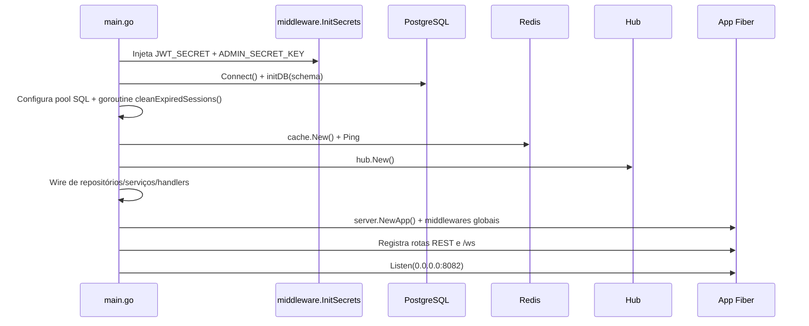

---

## 4) Mapa de APIs REST (grupos atuais)

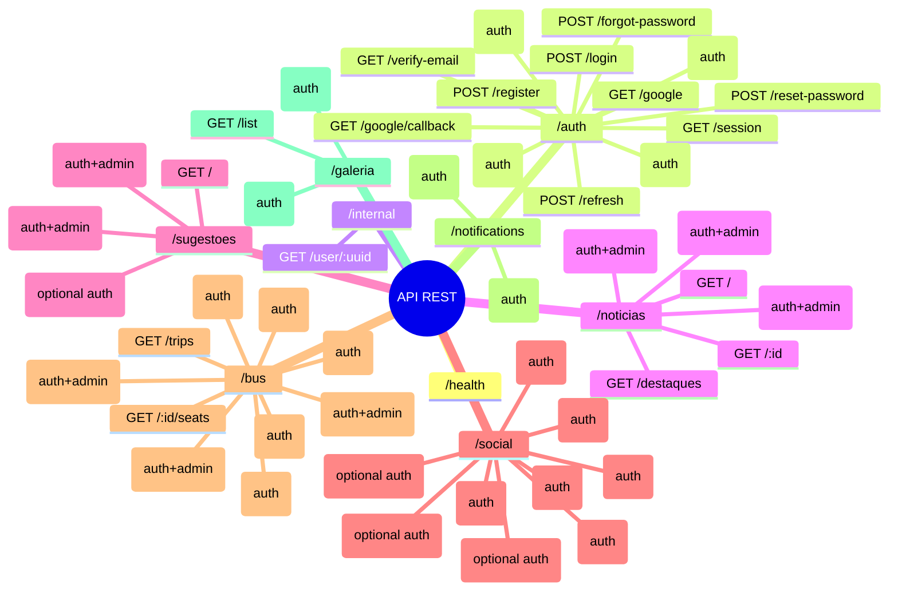

---

## 5) Fluxo de Autenticação e Sessão

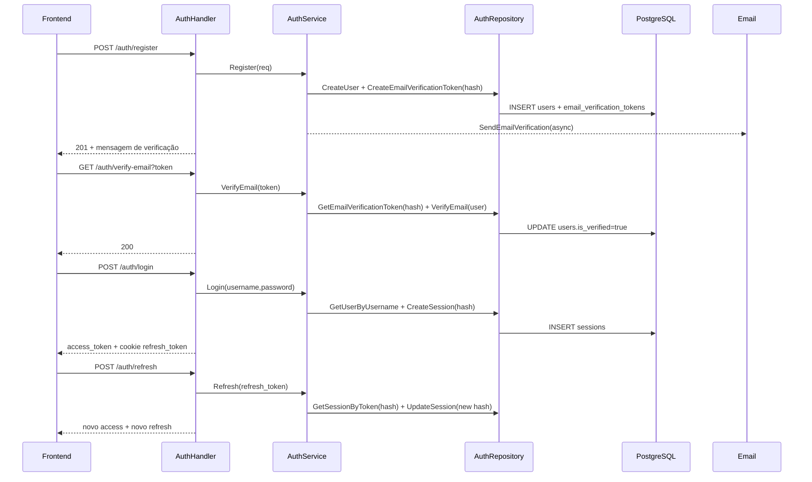

### OAuth Google

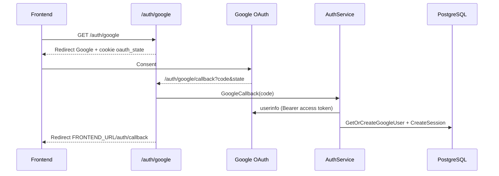

---

## 6) Fluxo Social + Notificações

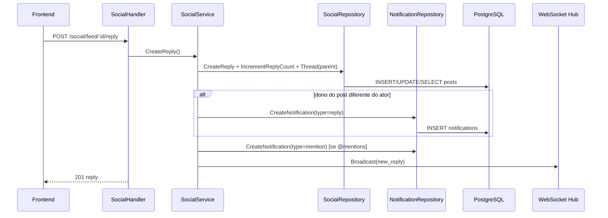

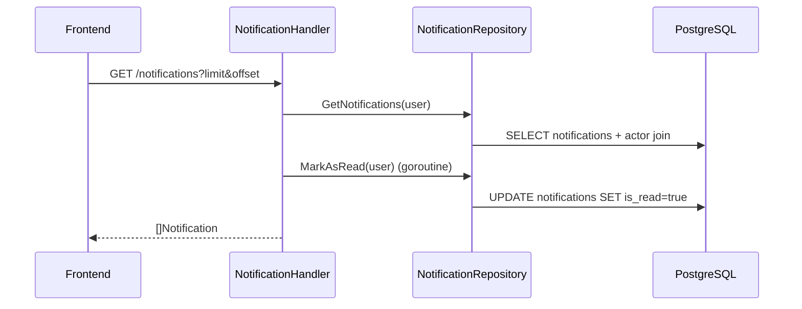

Tipos atualmente emitidos: `reply`, `repost`, `mention`, `like`.

---

## 7) WebSocket: Envelope e Broadcast

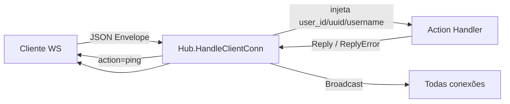

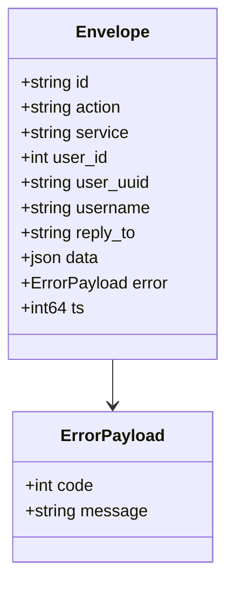

Eventos observados em produção de código:
- `user_login`, `user_logout`
- `new_post`, `new_reply`, `post_liked`, `post_deleted`, `profile_updated`
- `userCount`

---

## 8) Modelo de Dados (PostgreSQL)

```mermaid
erDiagram
    users ||--o{ sessions : has
    users ||--o| social_profiles : owns
    users ||--o{ posts : creates
    users ||--o{ notifications : receives
    users ||--o{ notifications : acts_as_actor
    users ||--o{ bus_seats : reserves
    users ||--o| bus_profiles : owns
    users ||--o{ galeria : uploads

    posts ||--o{ posts : replies_to
    posts ||--o{ post_likes : liked_by
    users ||--o{ post_likes : likes
    posts ||--o{ notifications : references

    bus_trips ||--o{ bus_seats : contains

    users {
      int id PK
      uuid uuid UK
      text username UK
      text email UK_nullable
      text password
      text google_id UK_nullable
      bool is_verified
      timestamp created_at
    }

    sessions {
      int id PK
      int user_id FK
      text refresh_token UK_hashed
      text user_agent
      text ip
      timestamp expires_at
      timestamp created_at
    }

    posts {
      int id PK
      text texto
      text author
      int user_id FK_nullable
      int parent_id FK_nullable
      int repost_id FK_nullable
      int likes
      int reply_count
      timestamp created_at
    }

    notifications {
      int id PK
      int user_id FK
      int actor_id FK_nullable
      text type
      int post_id FK_nullable
      bool is_read
      timestamp created_at
    }

    noticias {
      int id PK
      text titulo
      text conteudo
      text resumo
      text author
      text categoria
      text image_url
      bool destaque
      text[] tags
      timestamp created_at
      timestamp updated_at
    }

    sugestoes {
      int id PK
      text texto
      text author
      text categoria
      timestamp data_criacao
    }

    bus_trips {
      text id PK
      text name
      text description
      timestamp departure_time
      int total_seats
      bool is_completed
      timestamp created_at
      timestamp updated_at
    }

    bus_seats {
      text trip_id FK
      int seat_number
      int user_id FK_nullable
      timestamp reserved_at
      PK trip_id_seat_number
    }

    galeria {
      int id PK
      int user_id FK
      text author
      text author_name
      text avatar_url
      text image_url
      text public_id
      text caption
      timestamp created_at
    }
```

---

## 9) Modelos de Domínio (Go `pkg/models`)

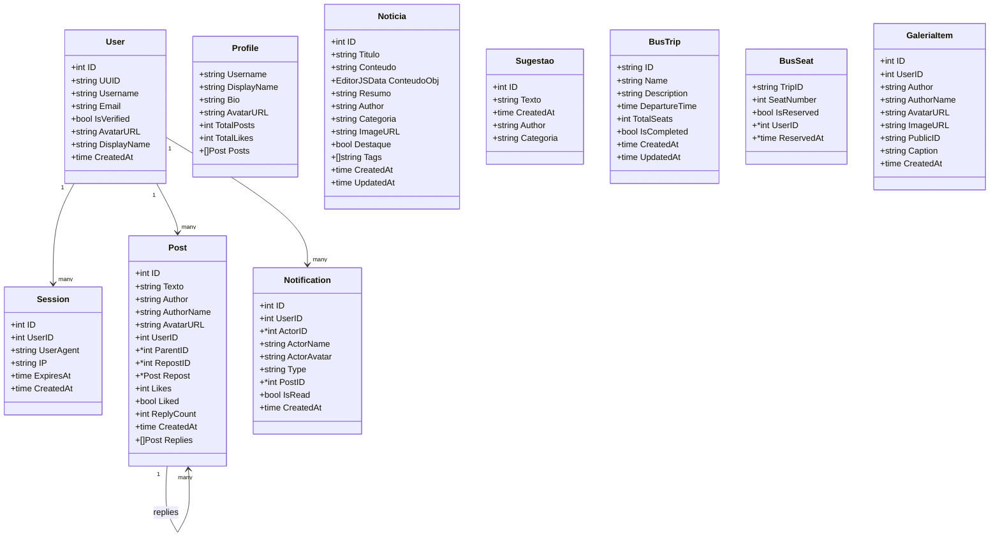

---

## 10) Estratégia de Cache (Redis)

```mermaid
flowchart TB
    subgraph Social
      SF[social:feed:{limit}:{offset}:lid{user}]:::ttl15
      ST[social:thread:{post}:lid{user}]:::ttl30
      SP[social:profile:{user}:lid{requester}]:::ttl30
    end

    subgraph Noticias
      NL[noticias:list:{categoria}:{limit}:{offset}]:::ttl30
      NI[noticias:item:{id}]:::ttl60
      ND[noticias:destaques]:::ttl30
    end

    subgraph Sugestoes
      SA[sugestoes:all]:::ttl30
    end

    subgraph Bus
      BT[bus:trips:all]:::ttl300
      BS[bus:{trip}:seats]:::ttl1
    end

    classDef ttl1 fill:#e3f2fd,stroke:#1e88e5,color:#0d47a1;
    classDef ttl15 fill:#e8f5e9,stroke:#43a047,color:#1b5e20;
    classDef ttl30 fill:#fff3e0,stroke:#fb8c00,color:#e65100;
    classDef ttl60 fill:#f3e5f5,stroke:#8e24aa,color:#4a148c;
    classDef ttl300 fill:#ffebee,stroke:#e53935,color:#b71c1c;
```

**Padrão:** leitura tenta cache primeiro; mutações invalidam chaves pontuais e/ou por `DelPattern`.

---

## 11) Segurança e Controles

```mermaid
flowchart LR
    A[AuthMiddleware] -->|JWT Bearer| B[user_id/user_uuid/username em Locals]
    C[OptionalAuthMiddleware] --> D[Rotas públicas com contexto opcional]
    E[AdminMiddleware] -->|X-Admin-Key + constant time compare| F[Rotas administrativas]
    G[Rate limiter] --> H[/auth/register,/auth/login,/auth/forgot-password,/auth/reset-password]
    I[Cookie refresh_token] --> J[HttpOnly + SameSite Lax + Secure em produção]
```

- Tokens de sessão persistidos em `sessions` como **hash SHA-256** (não texto puro).
- Senhas com `bcrypt`.
- OAuth com `oauth_state` para proteção CSRF.
- Limpeza periódica de `sessions` e `password_reset_tokens` expirados.

---

## 12) Infra e Deploy

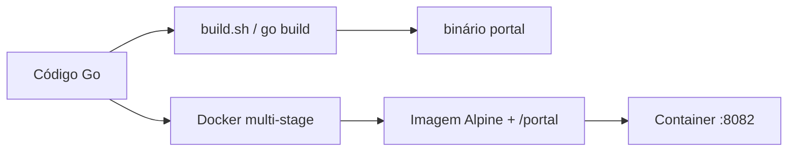

**Stack principal:** Fiber v2, PostgreSQL (`lib/pq`), Redis (`go-redis/v9`), JWT v5, OAuth2 Google, Resend/SMTP, Protobuf.

---

## 13) Variáveis de Ambiente (catálogo)

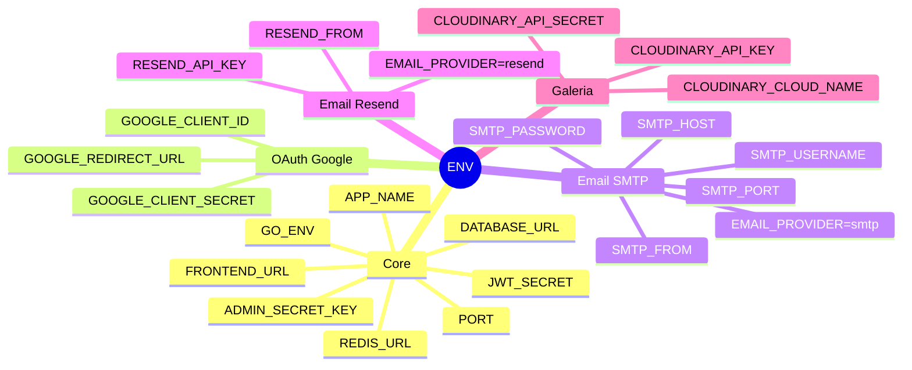

> Recomendação operacional: manter segredos fora de repositório e rotacionar credenciais periodicamente.

---

## 14) Observações Técnicas Relevantes

- O handler `CreateRepost` existe em `pkg/handlers/social.go`, porém a rota HTTP de repost não está registrada atualmente em `cmd/server/main.go`.
- `GET /notifications` já marca notificações como lidas em background (`go MarkAsRead`).
- O sistema usa dois canais de atualização para front:
  - Pull via REST + cache Redis.
  - Push via WebSocket Hub com eventos broadcast.

---

## 15) Estrutura de Pastas (alto nível)

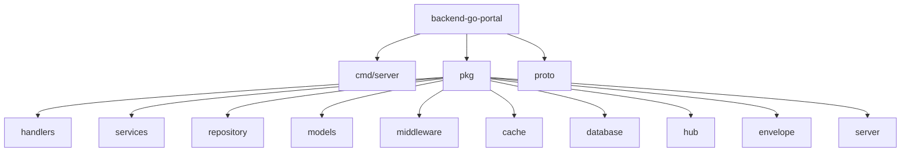

---

## 16) Execução local rápida

```bash
go mod download
go run ./cmd/server
```

ou com Docker:

```bash
docker build -t portal-backend .
docker run --env-file .env -p 8082:8082 portal-backend
```

---

## 17) Roadmap de documentação (próximos passos)

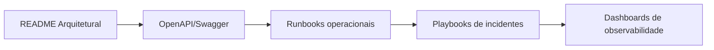

Este README representa o estado implementado no código atual e pode ser usado como base de onboarding técnico, desenho de integração frontend e operação em produção.
